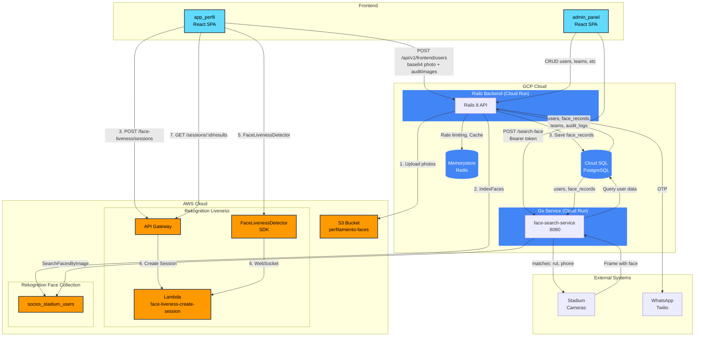
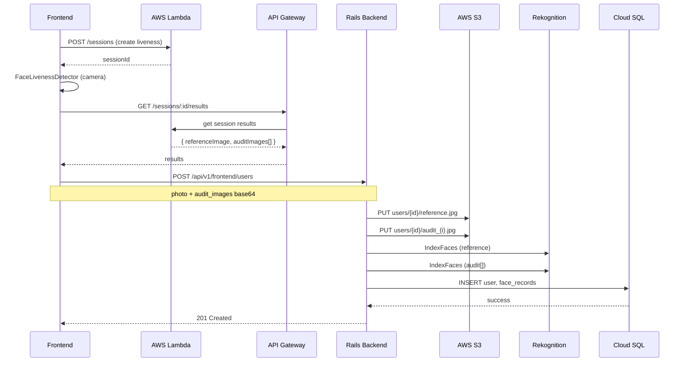
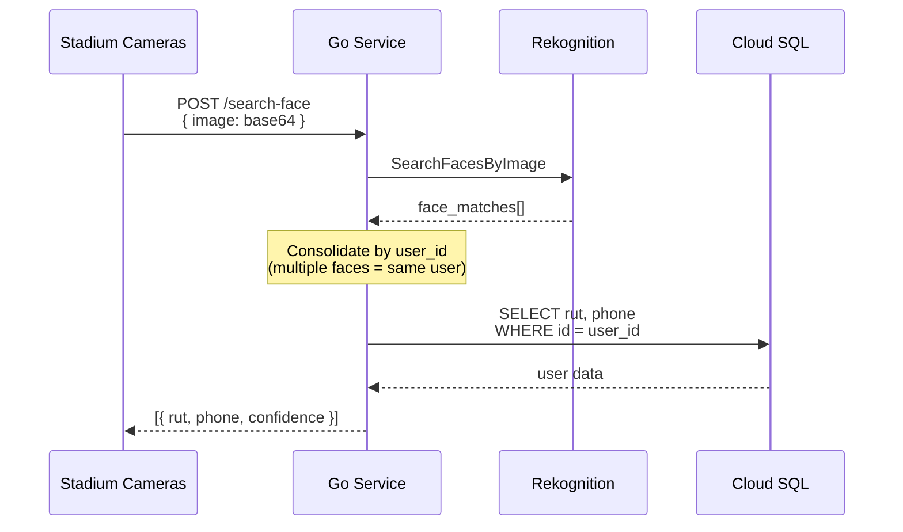

# Stadium Members App — Architecture

## Main flows

### User registration

### Face search

## Components per cloud

### AWS
| Component | Service | Purpose |
|-----------|----------|-----------|
| S3 Bucket | S3 | Store user photos |
| Face Collection | Rekognition | Face index for search |
| Lambda + API Gateway | Lambda | Face Liveness sessions |
| FaceLivenessDetector | Browser SDK | Liveness challenge UI |

### GCP
| Component | Service | Purpose |
|-----------|----------|-----------|
| Rails Backend | Cloud Run | REST API, business logic |
| Go Service | Cloud Run | Facial search (face search) |
| PostgreSQL | Cloud SQL | Data: users, face_records, teams |
| Redis | Memorystore | Cache, rate limiting |

## Terraform State

| Cloud | State Location |
|-------|---------------|
| AWS | S3 Bucket (`tf-state-aws`) |
| GCP | Cloud Storage (`tf-state-gcp`) |